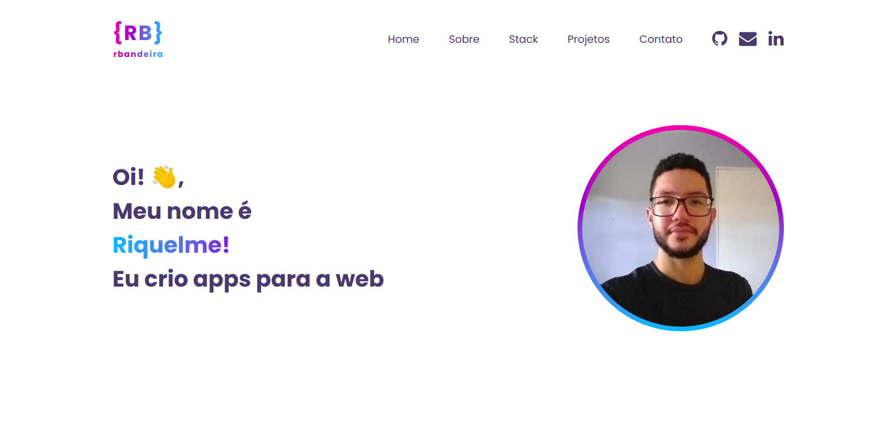

# <a href="https://riquelmebandeira.github.io" target="_blank">Meu portfólio pessoal</a>

Por favor, mande um email para riquelmebandeira1@outlook.com se tiver algum feedback ou ideia para o website. Deixe uma ⭐️ se gostar :)

✨ Baseado em [AVS1508](https://github.com/AVS1508/AVS1508.github.io)
